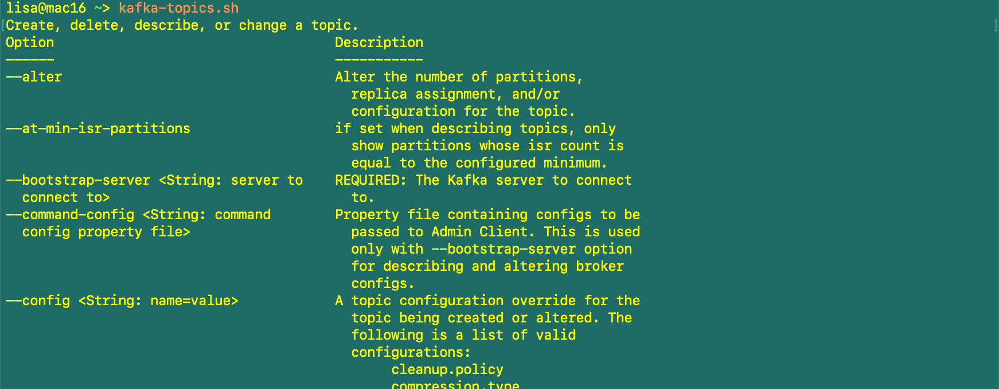

# Starting Kafka
For mac, could
- Start Kafka with Zookeeper (recommended)
- Start Kafka without Zookeeper -KRaft mode (for dev only)

Install Kafka CLI Tools using Binaries -> Start Kafka using Binaries

Go to `https://corretto.aws/downloads/latest/amazon-corretto-11-aarch64-macos-jdk.pkg` and download and install Java JDK 11. Go to `https://kafka.apache.org/downloads` and download `Scala 2.13  - kafka_2.13-3.3.1.tgz`. Exctract and copy the folder to your user home folder. Then, add the bin folder to PATH:
```
cd
vi .bash_profile
(then append this to file and exit: 
export PATH=$PATH:/Users/lisa/kafka_2.13-3.3.1/bin)
source ~/.bash_profile
echo $PATH
```
The last line of command should show a list of current Paths. 

Start Kafka by `kafka-topics.sh`:



