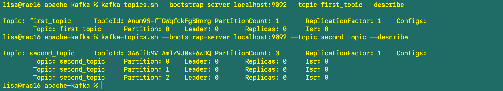

# 4. Kafka CLI

## Kafka topics CLI
### Create Kafka topics
To create a topic with 1 partition, with no replications by default: 
```
kafka-topics.sh --bootstrap-server localhost:9092 --topic first_topic --create
```

To create a topic with 3 partitions, with no replications by default:
```
kafka-topics.sh --bootstrap-server localhost:9092 --topic second_topic --create --partitions 3
```

To create a topic with 3 partitions and replication factor of 2 on a Kafka cluster:
```
kafka-topics.sh --bootstrap-server localhost:9092 --topic third_topic --create --partitions 3 --replication-factor 2
```

### List Kafka topics
```
kafka-topics.sh --bootstrap-server localhost:9092 --list
```

### Describe Kafka topics
```
kafka-topics.sh --bootstrap-server localhost:9092 --topic first_topic --describe
kafka-topics.sh --bootstrap-server localhost:9092 --topic second_topic --describe
kafka-topics.sh --bootstrap-server localhost:9092 --describe
```


### Delete Kafka topic
```
kafka-topics.sh --bootstrap-server localhost:9092 --topic third_topic --delete
```

## Kafka Console Producer CLI
If produce without keys, then the data will be distributed across all partitions; if produce with key, then the data with the same key always go to the same partition. `kafka-console-producer.sh`. 

### producing
```
kafka-console-producer.sh --bootstrap-server localhost:9092 --topic first_topic 
>Hello World
>My name is lisa
>I love Kafka
>^C  (<- Ctrl + C is used to exit the producer)
```

### producing with properties
```
kafka-console-producer.sh --bootstrap-server localhost:9092 --topic first_topic --producer-property acks=all
>some message that is acked
>just for fun
>fun learning!
```

### producing to a non existing topic
If you produce to a non existing topic, Kafka will create that topic for you by default, but you will see a few retriable warnings before it is ready. 
```
kafka-console-producer.sh --bootstrap-server localhost:9092 --topic new_topic
>hello world!
```
Our auto created topic only has 1 partition. But you can edit the default settings by editing the config/server.properties or config/kraft/server.properties, and set `num.partitions=3`.

Overall, please create topics before producing to them!

### produce with keys
The message format is `key:value` pairs. If you did not enter the whole pair, there will be an error. 
```
kafka-console-producer.sh --bootstrap-server localhost:9092 --topic first_topic --property parse.key=true --property key.separator=:
>example key:example value
>name:lisa
```

## Kafka Console Consumer CLI
### consuming
The consumer by default will not read messages that are produced before it is started - it will only read new messages. 
```
kafka-console-consumer.sh --bootstrap-server localhost:9092 --topic first_topic
```

### consuming from beginning
To override the default: 
```
kafka-console-consumer.sh --bootstrap-server localhost:9092 --topic first_topic --from-beginning
```
Notice that the messages are not displayed in the order that I have created them. This is because we have 3 partitions, and the messages are only ordered within each partition, not across partitions. If you have only one partition, then all the messages will be in order, but then you will lose the scaling aspects of Apache Kafka, with only one partition and only one consumer. 

### display key, values and timestamp in consumer
```
kafka-console-consumer.sh --bootstrap-server localhost:9092 --topic first_topic --formatter kafka.tools.DefaultMessageFormatter --property print.timestamp=true --property print.key=true --property print.value=true --from-beginning
```
And the return:
```
CreateTime:1666232367197        null    Hello World
CreateTime:1666232371266        null    My name is lisa
CreateTime:1666232374956        null    I love Kafka
CreateTime:1666233633661        null    round
CreateTime:1666233668382        null    Boo
CreateTime:1666234321568        name    lisa
CreateTime:1666232594753        null    a
CreateTime:1666232595476        null    b
CreateTime:1666232597905        null    c
CreateTime:1666234315792        example key     example value
```

## Kafka Consumers in Group
The Kafka topic needs to have more than one topics to start this part. 
### Start one producer and start producing
```
kafka-console-producer.sh --bootstrap-server localhost:9092 --topic first_topic
```

### Start one consumer with a group name
```
kafka-console-consumer.sh --bootstrap-server localhost:9092 --topic first_topic --group my-first-consumer-group
```

### Start another consumer of the same group
See messages being spread:
```
kafka-console-consumer.sh --bootstrap-server localhost:9092 --topic first_topic --group my-first-consumer-group
```
If start more consumers than num of partitions, the additional consumers will stay idle. 

### Start another consumer of different group from beginning
If start another consumer from a different group, then both group receive new messages. Is use from-beginning with first topic, will produce nothing because it has already moved the offset. 
```
kafka-console-consumer.sh --bootstrap-server localhost:9092 --topic first_topic --group my-second-consumer-group --from-beginning
```

## Kafka Consumer Groups CLI
### list consumer groups
```
kafka-consumer-groups.sh --bootstrap-server localhost:9092 --list
``` 
### describe one specific group
```
kafka-consumer-groups.sh --bootstrap-server localhost:9092 --describe --group my-second-consumer-group
```
It will list all partitions for this group. CURRENT-OFFSET show where the current offset is and LOG-END-OFFSET shows where the end of the offset is; The LAG value will be 0 if both of them match. If we add more messages into this topic, then run the describe command again, we will see the LOG-END-OFFSET increase, and the LAG increase, while CURRENT-OFFSET will not change. Now if we run kafka-console-consumer for this group and topic, we will receive the new messages. If we start another consumer in the same consumer group, and then do a describe, we will see that two partitions will be assigned to one consumer in the group, and one partition will be assigned to another consumer of the group, by reading the CONSUMER-ID column. Which verifies that the two consumers in this group are spreading the reads. 

If we start a consumer without a group id, and specify to start from the beginning, then we automatically start a new group, and read all the messages in this topic. But this group is temporary, and will be deleted as soon as this consumer is off. This temp group and consumer doesn't have a CURRENT-OFFSET and LAG defined when we describe it. 

## Resetting Offsets
### reset the offsets to the beginning of each partition
```
kafka-consumer-groups.sh --bootstrap-server localhost:9092 --group my-first-consumer-group --reset-offsets --to-earliest --execute --topic first_topic
```
This will return us NEW-OFFSET for all partitions to be 0. Now if we start a consumer of this group, and it will automatically read all messages from the start. If we describe it again, the LAG is 0. 

### shift offsets forward by 2
``` 
kafka-consumer-groups.sh --bootstrap-server localhost:9092 --group my-first-consumer-group --reset-offsets --shift-by 2 --execute --topic first_topic
```
To do it backward, just replace the `2` with `-2`. If we do backward, we will move the offset of each partition back by 2, and with 3 partitions, if we read from this topic again for this topic, we will get 6 messages. 


