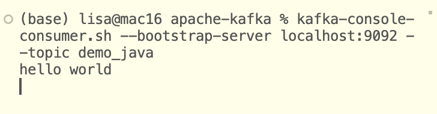

# 5. Kafka Java Programming
SDK List of Kafka: The official SDK for Apache Kafka is the Java SDK. For other languages, it's community supported: Scala, C, C++, Golang, Python, Javascript, .NET, C#, Rust, Kotlin, Haskell, Ruby...

Kafka project setup:
- IntelliJ Community IDEA
- Java 11 JDK installed
- Will set up the project using Gradle. 

## Creating Kafka Project
New Project -> Name: kafka-java, Location: (custom), Language: Java, Build system: Gradle, JDK: 11, GroupId: lumos.lisa, ArtifactId: kafka-java -> Create. After the project opens, delete the src folder. 

Right click on the kafka-java project folder, New -> Module..., Name: kafka-basics, Language: Java, Build system: Gradle, JDK: 11 -> Create. 

Google search for "kafka maven" to go to `https://mvnrepository.com/artifact/org.apache.kafka`, click on the hyperlink kafka-clients, click on latest version (3.3.1) hyperlink, click on the Gradle(Short) tab, copy the contents in the box below, and paste it inside dependencies block in the build.gradle file under the kafka-basics folder: 
```
dependencies {
    // https://mvnrepository.com/artifact/org.apache.kafka/kafka-clients
    implementation 'org.apache.kafka:kafka-clients:3.3.1'

    testImplementation 'org.junit.jupiter:junit-jupiter-api:5.8.1'
    testRuntimeOnly 'org.junit.jupiter:junit-jupiter-engine:5.8.1'
}
```

Next, in the search bar on top, search for "slf4j api", then click on the "slf4j api" hyperlink, chose the latest non-beta one, copy the contents in the box below the Gradle (Short) tab, and paste it there too:
```
dependencies {
    // https://mvnrepository.com/artifact/org.apache.kafka/kafka-clients
    implementation 'org.apache.kafka:kafka-clients:3.3.1'

    // https://mvnrepository.com/artifact/org.slf4j/slf4j-api
    implementation 'org.slf4j:slf4j-api:1.7.36'

    testImplementation 'org.junit.jupiter:junit-jupiter-api:5.8.1'
    testRuntimeOnly 'org.junit.jupiter:junit-jupiter-engine:5.8.1'
}
```

Next, in the search bar on top, search for "slf4j simple", then click on the "slf4j simple" hyperlink, chose the latest non-beta one, copy the contents in the box below the Gradle (Short) tab, and paste it there too:
```
dependencies {
    // https://mvnrepository.com/artifact/org.apache.kafka/kafka-clients
    implementation 'org.apache.kafka:kafka-clients:3.3.1'

    // https://mvnrepository.com/artifact/org.slf4j/slf4j-api
    implementation 'org.slf4j:slf4j-api:1.7.36'

    // https://mvnrepository.com/artifact/org.slf4j/slf4j-simple
    testImplementation 'org.slf4j:slf4j-simple:1.7.36'

    testImplementation 'org.junit.jupiter:junit-jupiter-api:5.8.1'
    testRuntimeOnly 'org.junit.jupiter:junit-jupiter-engine:5.8.1'
}
```

Remove the test implementations inside the block, and change the "testImplementation" to "implementation" in the third one:
```
dependencies {
    // https://mvnrepository.com/artifact/org.apache.kafka/kafka-clients
    implementation 'org.apache.kafka:kafka-clients:3.3.1'

    // https://mvnrepository.com/artifact/org.slf4j/slf4j-api
    implementation 'org.slf4j:slf4j-api:1.7.36'

    // https://mvnrepository.com/artifact/org.slf4j/slf4j-simple
    implementation 'org.slf4j:slf4j-simple:1.7.36'
}
```

To pull the dependencies in Gradle, click the "Load Gradle changes" icon in the upper right corner of the editor. 

Right click on the kafka-basics/src/main/java folder, New -> JavaClass, Name: lisa.lumos.demos.kafka.ProducerDemo, and enter. Then a folder named lumos.demos.kafka is created, with ProducerDemo.java file inside. Create a main function inside the class ProducerDemo, and to test whether the code works:
```java
package lisa.lumos.demos.kafka;

public class ProducerDemo {
    public static void main(String[] args) {
        System.out.println("Hello world!");
    }
}
```

Run it, and see the output. 

IntelliJ IDEA -> Settings -> Build, Execution, Deployment -> Build Tools -> Gradle -> Choose: Build and run using: IntelliJ IDEA -> Apply -> OK. 

Run the code again, and get a cleaner output window. 

## Java Producer
In the file ProducerDemo.java:
```java
package lisa.lumos.demos.kafka;
import org.apache.kafka.clients.producer.KafkaProducer;
import org.apache.kafka.clients.producer.ProducerConfig;
import org.apache.kafka.clients.producer.ProducerRecord;
import org.apache.kafka.common.serialization.StringSerializer;
import org.slf4j.Logger;
import org.slf4j.LoggerFactory;
import java.util.Properties;

public class ProducerDemo {
    private static final Logger log = LoggerFactory.getLogger(ProducerDemo.class.getSimpleName());
    public static void main(String[] args) {
        log.info("Hello world!");

        // create producer properties
        Properties properties = new Properties();
        // properties.setProperty("bootstrap.servers", "127.0.0.1:9092");
        // can also use below instead:
        properties.setProperty(ProducerConfig.BOOTSTRAP_SERVERS_CONFIG, "127.0.0.1:9092");
        properties.setProperty(ProducerConfig.KEY_SERIALIZER_CLASS_CONFIG, StringSerializer.class.getName());
        properties.setProperty(ProducerConfig.VALUE_SERIALIZER_CLASS_CONFIG, StringSerializer.class.getName());

        // create the producer
        KafkaProducer<String, String> producer = new KafkaProducer<>(properties);

        // create a producer record
        ProducerRecord<String, String> producerRecord =
                new ProducerRecord<>("demo_java", "hello world");

        // send data - async operation, so need to flush, otherwise code complete and not yet send
        producer.send(producerRecord);

        // flush (synchronous) and close the producer
        producer.flush(); // wait until data is sent to the producer
        producer.close(); // note the close method also calls flush for you,
        // But flush method is available to you if needed in the future.
    }
```

Before we run the code, need to open the terminal, and create a topic named demo_java, and start a console consumer on it. 

```sh
kafka-topics.sh --bootstrap-server localhost:9092 --create --topic demo_java --partitions 3 --replication-factor 1

kafka-console-consumer.sh --bootstrap-server localhost:9092 --topic demo_java
```

Now run the code in IntelliJ. The code output a lot of logs and exit with code 0 (successful). In the meantime, can see "hello world" is output from the consumer from the command line window. 



## Java Producer Callbacks
Duplicate the file ProducerDemo.java to ProducerDemoWithCallback.java, change row 31 to 
```java
        producer.send(producerRecord, new Callback() {
            @Override
            public void onCompletion(RecordMetadata metadata, Exception e) {
                // executes every time a record is successfully sent or throws an exception
                if (e == null) {
                    // the record was successfully sent
                    log.info("Received new metadata./ \n" +
                            "Topic: " + metadata.topic() + "\n" +
                            "Partition: " + metadata.partition() + "\n" +
                            "Offset: " + metadata.offset() + "\n" +
                            "Timestamp: " + metadata.timestamp());
                } else {
                    log.error("Error while producing", e);
                }
            }
        });
```

Run the code (Note do not run the previous code, make sure you run the new code, check code name next to the run button), and notice that because the key is null, so the message is sent to different partitions each time you run it (round robin), and the offset within one partition is constantly increasing. 

But when you send a few messages in one loop, all messages are sent to one partition:
```java
         for (int i = 0; i < 10; i++) {
            // create a producer record
            ProducerRecord<String, String> producerRecord =
                    new ProducerRecord<>("demo_java", "hello world " + i);
             // send data - async operation, so need to flush, otherwise code complete and not yet send
             producer.send(producerRecord, new Callback() {
                @Override
                public void onCompletion(RecordMetadata metadata, Exception e) {
                    // executes every time a record is successfully sent or throws an exception
                    if (e == null) {
                        // the record was successfully sent
                        log.info("Received new metadata./ \n" +
                                "Topic: " + metadata.topic() + "\n" +
                                "Partition: " + metadata.partition() + "\n" +
                                "Offset: " + metadata.offset() + "\n" +
                                "Timestamp: " + metadata.timestamp());
                    } else {
                        log.error("Error while producing", e);
                    }
                }
            });
        }

```
This is because of the sticky partitioner (The producer will automatically batch it for you to make it more efficient). 

But if we add a sleep for the thread after each loop:
```java
         for (int i = 0; i < 10; i++) {
            // create a producer record
            ProducerRecord<String, String> producerRecord =
                    new ProducerRecord<>("demo_java", "hello world " + i);
            // send data - async operation, so need to flush, otherwise code complete and not yet send
            producer.send(producerRecord, new Callback() {
                @Override
                public void onCompletion(RecordMetadata metadata, Exception e) {
                    // executes every time a record is successfully sent or throws an exception
                    if (e == null) {
                        // the record was successfully sent
                        log.info("Received new metadata./ \n" +
                                "Topic: " + metadata.topic() + "\n" +
                                "Partition: " + metadata.partition() + "\n" +
                                "Offset: " + metadata.offset() + "\n" +
                                "Timestamp: " + metadata.timestamp());
                    } else {
                        log.error("Error while producing", e);
                    }
                }
            });
            try {
                Thread.sleep(1000);
            } catch (InterruptedException e) {
                e.printStackTrace();
            }
        }
```
Then the message will be sent to a different partition each time. 

## Java Producer with Keys


